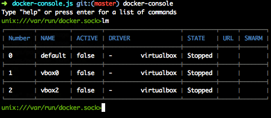

## docker-console [![npm][npm-svg]][npm]

[![Build Status][travis-svg]][travis]
[![Code Climate][codeclimate-svg]][codeclimate]
[![Test Coverage][codeclimate-test-svg]][codeclimate-test]
[![downloads][npm-download-svg]][npm]
[![license][npm-license-svg]][npm]

[npm]: https://npmjs.org/package/docker-console
[npm-svg]: https://img.shields.io/npm/v/docker-console.svg
[npm-download-svg]: https://img.shields.io/npm/dm/docker-console.svg
[npm-license-svg]: https://img.shields.io/npm/l/docker-console.svg
[travis-svg]: https://img.shields.io/travis/snowyu/docker-console.js/master.svg
[travis]: http://travis-ci.org/snowyu/docker-console.js
[codeclimate-svg]: https://codeclimate.com/github/snowyu/docker-console.js/badges/gpa.svg
[codeclimate]: https://codeclimate.com/github/snowyu/docker-console.js
[codeclimate-test-svg]: https://codeclimate.com/github/snowyu/docker-console.js/badges/coverage.svg
[codeclimate-test]: https://codeclimate.com/github/snowyu/docker-console.js/coverage

This is a conosle tools for docker!

third-libries:

* [shell](https://github.com/wdavidw/node-shell): shell framework
* [nodedm](https://github.com/lawrence0819/nodedm): docker-machine
* [dockerode](https://github.com/apocas/dockerode): docker
* [cli-table](https://github.com/Automattic/cli-table): format table string.

## Usage


## 0. Quick Start

**First, install docker & docer-machine & nodejs!**

```bash
$ npm i -g docker-console
$ docker-console lm # directly run the commands.
$ docker-console
unix:///var/run/docker.sock > _
```



## 1. machine commands

### 1.1. list machine (or search machine)

```
unix:///var/run/docker.sock > lm
Number  Name                	URL                         Labels
0       local               	tcp://192.168.99.100:2376   web
1       swarm-agent-00      	tcp://192.168.99.102:2376
2       swarm-agent-01      	tcp://192.168.99.103:2376
3       swarm-master        	tcp://192.168.99.101:2376   db
=> "Total 4 machines."
unix:///var/run/docker.sock > lm swarm
Number  Name                	URL                         Labels
0       swarm-agent-00      	tcp://192.168.99.102:2376   web
1       swarm-agent-01      	tcp://192.168.99.103:2376
2       swarm-master        	tcp://192.168.99.101:2376   db
=> "Total 3 machines."
unix:///var/run/docker.sock > lm * web
Number  Name                	URL                         Labels
0       local               	tcp://192.168.99.100:2376   web
=> "Total 1 machines."
```

### 1.2 connect machine

```
unix:///var/run/docker.sock > cm local
=> "Connected Docker: tcp://192.168.99.101:2376"
tcp://192.168.99.101:2376 > lm swarm
Number  Name                	URL                         Labels
0       swarm-agent-00      	tcp://192.168.99.102:2376
1       swarm-agent-01      	tcp://192.168.99.103:2376
2       swarm-master        	tcp://192.168.99.101:2376   db
=> "Total 3 machines."
tcp://192.168.99.101:2376 > cm 2
=> "Connected Docker: tcp://192.168.99.101:2376"
tcp://192.168.99.101:2376 > cm tcp://192.168.99.102:2376
=> "Connected Docker: tcp://192.168.99.102:2376"
```

# 2. container commands

## 2.1. list container
```
tcp://192.168.99.100:2376 > lc
ID      	Image               	Name                	Command                       	Status              	Port
3edb26a6	nginx               	/berserk_brattain   	nginx -g 'daemon off;'        	Up 2 seconds        	:443->/tcp
3edb26a6	nginx               	/berserk_brattain   	nginx -g 'daemon off;'        	Up 2 seconds        	:80->/tcp
=> "Total 1 containers."
```
### 2.2. rm container
```
tcp://192.168.99.100:2376 > rm 3edb26a6
=> "Container 3edb26a6 Deleted!"
```
### 2.3. run container
```
tcp://192.168.99.100:2376 > run nginx -p 80:80,443:443
=> nil
tcp://192.168.99.100:2376 > run swarm --rm create
!fc23ab04571c9e6f388a60f914ba697e
=> nil
```
### 2.4. multi run containers
```
tcp://192.168.99.100:2376 > lm
Number  Name                	URL                         Labels
0       local               	tcp://192.168.99.100:2376   web
1       swarm-agent-00      	tcp://192.168.99.102:2376
2       swarm-agent-01      	tcp://192.168.99.103:2376
3       swarm-master        	tcp://192.168.99.101:2376   db
=> "Total 4 machines."
tcp://192.168.99.100:2376 > mrun nginx -p 80:80,443:443
=> "Run command at 4 machines."
```
# 3. image commands
# 3.1. list image
```
tcp://192.168.99.100:2376 > li
ID          	Image                                                       	Tag             	VSize
fac9d14f6fe0	composerails_web                                            	latest          	914.3 MB
09897cd2cc05	postgres                                                    	latest          	265.1 MB
81415e35fc6c	nginx                                                       	latest          	132.7 MB
6b40fe7724bd	swarm                                                       	1.0.0           	15.6 MB
6b40fe7724bd	swarm                                                       	latest          	15.6 MB
0a6ba66e537a	hello-world                                                 	latest          	960 B
ac90cee00759	ruby                                                        	2.2.0           	774.6 MB
=> "Total 6 images."
```


## License

MIT
